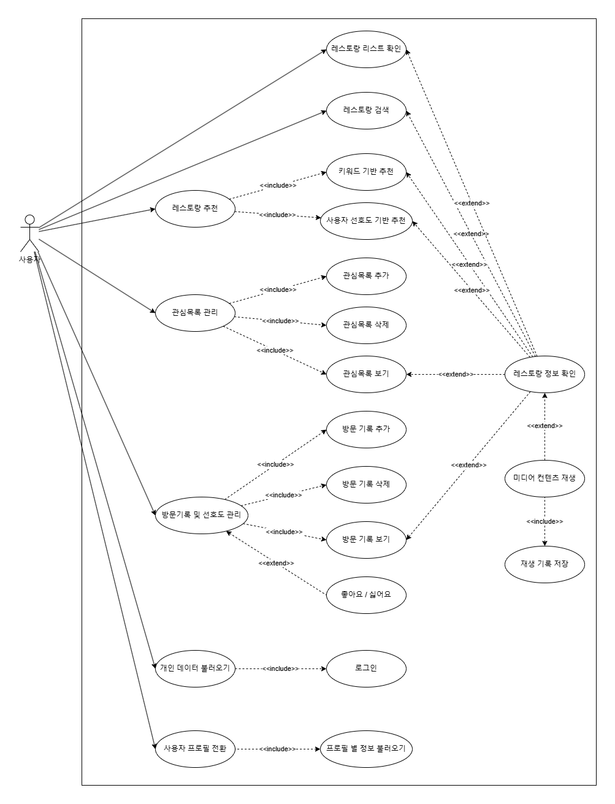

# Michelin in TV
## 목차
- [1. Introduction](#1-introduction)
    - [1.1. 문서 목적 (Purpose)](#11-문서-목적-document-purpose)
    - [1.2. 시스템 범위 (Scope)](#12-시스템-범위-system-scope)
        - [1.2.1. 개발 개요 (Development Overview)](#121-개발-개요-development-overview)
        - [1.2.2. 주요 기능 (Main Features)](#122-주요-기능-main-features)
    - [1.3. 개발 환경 (Development Environment)](#14-개발-환경-development-environment)
- [2. Architectural Drivers](#2-architectural-drivers)
    - [2.1. 유스케이스 다이어그램 (Use Case Diagram)](#21-유스케이스-다이어그램-use-case-diagram)
    - [2.2. 기능 요구사항 (Functional Requirements)](#22-기능-요구사항-functional-requirements)
    - [2.3. 비기능 요구사항 (Non-Functional Requirements)](#23-비기능-요구사항-non-functional-requirements)
- [3. Architectural Overview](#3-arthitectural-overview)
    - [3.1. 시스템 구조도 (System Context)](#31-시스템-구조도-system-context)
    - [3.2. Static Perspective](#32-static-perspective)
    - [3.2. Dynamic Perspective](#32-dynamic-perspective)
- [4. Data Design](#4-data-design)
    - [4.1. Database Schema](#41-database-schema)

## 1. Introduction
### 1.1. 문서 목적 (Document Purpose)

본 문서는 LG전자의 무선 TV 제품인 「LG 스탠바이미」에서 작동하는 Media Web Application 개발 과제인 「Michelin in TV」의 소프트웨어 아키텍처 문서이다. 본 문서는 「Michelin in TV」의 개발 목적, 범위, 개발 환경 등을 기술하며, 시스템의 기능 및 비기능 요구사항, 시스템의 구조 및 데이터베이스 스키마 등을 명확히 하여 문서화 하는 것을 목적으로 한다.

### 1.2. 시스템 범위 (System Scope)
#### 1.2.1. 개발 개요 (Development Overview)

본 과제에서는 LG전자의 무선 TV 제품인 「LG 스탠바이미」에서 작동하는 Media Web Application 개발 과제로서 「Michelin in TV」의 개발을 수행한다. 최근 넷플릭스에서 방영한 요리 경연 프로그램인 「흑백요리사」의 인기로 미쉐린 가이드에서 선정한 레스토랑에 대한 관심이 높아지고 있다. 이러한 트렌드를 반영하여, 「Michelin in TV」는 사용자들이 손쉽게 미쉐린 가이드에 등재된 레스토랑의 정보를 탐색할 수 있도록 개발한다.

#### 1.2.2. 주요 기능 (Main Features)

본 시스템에서 제공하는 주요 기능은 다음과 같다:

1. *미쉐린 가이드 레스토랑 정보 제공*  
2. *키워드 기반 레스토랑 추천*  
3. *키워드 중심 레스토랑 검색*  
4. *레스토랑 관련 영상 컨텐츠 제공*  
5. *찜목록 및 방문 기록 관리 기능*  
6. *사용자 데이터 기반 맞춤형 추천*  
7. *사용자 프로필 및 다중 사용자 지원*  
8. *로그인을 통한 데이터 동기화*  

상세한 기능 요구사항은 [2. Architectural Drivers](#2-architectural-drivers)에서 확인할 수 있다.

### 1.3. 개발 환경 (Development Environment)
**OS** : Linux, MacOS 
**IDE** : Visual Studio Code 
**Framework** : EnactJS, Express.js, mongoose, mongoDB 
**Language** : JavaScript 
**Version Control** : Git, GitHub 
**Platform** : LG StandbyMe

## 2. Architectural Drivers
이 절에서는 개발 과제의 유스케이스 다이어그램, 기능 요구사항, 비기능 요구사항을 기술한다.
### 2.1. 유스케이스 다이어그램 (Use Case Diagram)

### 2.2. 기능 요구사항 (Functional Requirements)
### 2.3. 비기능 요구사항 (Non-Functional Requirements)

## 3. Arthitectural Overview
### 3.1. 시스템 구조도 (System Context)
### 3.2. Static Perspective
### 3.2. Dynamic Perspective

## 4. Data Design
### 4.1. Database Schema

<!-- 
# Software Architecture Document Guide
__문서 작성 시 가장 중요한 것은 UML을 얼마나 잘 썼는지, 얼마나 많이 썼는지 등 보다는, 읽는 사람에게 얼마나 쉽게 의미가 잘 전달 되었는지다.__
## 1. Introduction
* 문서 목적: 문서가 작성되는 이유와 달성하고자 하는 목표
* 시스템 범위: 개발 하는 시스템의 간략한 개요 및 주요 기능

## 2. Architectural Drivers
* 주어진 과제의 성공을 위해 개발하는 시스템이 만족해야하는 기능과 비기능 요구사항 작성

### 기능 요구사항 (Functional Requirements)
* 시스템이 제공해야 하는 모든 기능을 명확하게 기술하며, 명세 내용은 모두가 이해하기 쉽고 간결하게 작성한다.
* 외부모듈로부터의 특정 입력에 대한 요구사항
* 특정 상황에서 제품이 제공해야하는 동작 기능에 대한 요구사항

### 비기능 요구사항 (Non-Functional Requirements) (Optional)
* 설계에 영향을 주는 주요 비 기능적인 요구사항을 기술한다.
* 품질 기준 등을 만족시키기 위해 소프트웨어가 가져야 하는 성능, 보안성, 재사용성, 신뢰성과 같은 행위적 특성을 기술한다.
* 시스템에 요구되는 품질 속성 중에서 시스템이 실행될 때 식별될 수 있는 것으로써 Performance, Security, Usability, Reliability 등이 여기에 해당한다.

성능(Performance)
* 특정 요청에 대해 제품이 어느 정도의 시간 안에 응답해야하는지, 특정 입/출력 프로세싱에 있어 단위 시간 당 어느 정도의 양을 처리해야 하는지에 대한 성능적인 요구사항

보안성(Security)
* 제품 내보의 정보와 데이터에 대해 권한이 없는 사용자나 시스템의 접근을 막기 위한 보안 관련 요구사항

신뢰성(Reliability)
* stress 환경, 악조건, interrupt 발생 시 등의 특정 상황에서도 일정 수준 이상의 정상 동작을 보장해야 함에 대한 요구사항 (ex. 온도에 대한 내구성)

Usability(사용편의성)
* 사용자가 원하는 작업을 쉽게 수행하고 직관성을 높이기 위해 시스템이 제공해야할 사용자 지원 관련 요구사항
    * 사용자가 시스템 사용법을 더 쉽게 배울 수 있도록 시스템은 무엇을 제공해야하는가?
    * 사용자가 작업을 더 쉽게 하도록 시스템이 어떠한 지원을하면 될지?

## 3. Architecture Overview
### 시스템 컨텍스트 (System Context)
시스템의 바운더리(Boundary)를 정의하고, 다음의 항목을 기술하여 소개한다.
* 시스템의 논리적 구조에 대한 간략한 설명
* 본 시스템 외부의 외부 외부 (External Entities)와의 관계에 대한 간략한 설명
* 주의사항 : 기술적인 설계 및 구현과 관련된 구조 정보는 표기하지 않는다.
* 시스템의  바운더리를 중심으로 관련된 외부 (소프트웨어 시스템/컴포넌트, 서버, 사용자, 외부 장비 등) 와 어떤 관계를 맺고있는지 표현
* 외부로부터 System에게 가해지는 
* 기술방법에 대한 제약은 없지만, 표준 UML 표기법을 따르거나, 공통적인 이해를 위해 사용된 표기법에 대한 범례(legend)를 추가한다.
* 하이 레벨 관계만 표현하고 상세한 정보는 기술하지 않는다.

### Static Perspective
* 기능 상의 응집력 있는 단위를 제공하는 주요 소프트웨어 모듈 열거
* 모듈 간의 관계 표시
* 모듈의 간략한 Roles & Responsibilities 기술
    * Architectural Drivers로 식별된 요구사항을 대응하기 위한 모듈인지

### Dynamic Perspective
* 동적인 실행시간 관점에서 주요 상호작용 표현
* 실행시간에 존재하는 요소
    * 프로세스, 오브젝트, 인스턴스, 클라이언트, 서버, DB 등
* 주요 개체들간의 상호작용
    * 주요 개채들과 어떻게 상호작용하고 데이터가 어떻게 흐르는지
* UML로 표기한다면 UML의 Behavioral Diagrams로 표현할 수 있다.
    * Sequence diagram, Activity diagram, State machine diagram, Communication diagram 등

## 4. Data Design
시스템에서 사용하는 데이터베이스에는 어떤 스키마들이 정의되어 있는지 작성한다.
해당 스키마는 어떠한 요구사항을 대응하기 위한 것인지.

----

P.S. 3. Architecture Overview의 (Static Perspective/Dynamic Perspective)에서 상세 설계 작성 시 가능하면, 간략하게 어떤 고민을 해서 설계를 결정한 것인지 기술한다.

----

# Test Plan Document Guide
* 분석하고 명세화한 요구사항에 따라 시스템이 개발 되었음을 검증하기 위해 어떠한 테스트 전략을 세웠는지 자유롭게 기술한다.
* 요구사항에 기반하여 도출된 테스트 시나리오에 대해서 필요에 따라 유닛 테스트(Unit Test) / 통합 테스트 (Integration Test) / 시스템 테스트 (System Test)를 구성한다.
   * 체계적으로 모듈별 유닛 테스트 (Unit Test), 모듈간에 통합 테스트 (Integration Test), 시스템이 제공하는 기능들에 대한 시스템 테스트 (System Test)로 테스트를 설계하면 좋지만 본 텀 프로젝트에서 무조건 요구하는 수준은 아니다.
   * 텀 프로젝트에서 요구하는 수준과 취지는 명세화한 요구사항에 기반하여 테스트를 적절하게 도출하고 테스트 했는지 경험하고자 하는데 있다.
   * 테스트 시나리오 혹은 테스트 케이스를 도출 할 때 Positive Test외에도 Negative Test에 대해서도 생각해본다.
* 테스트 수행 계획과 결과 첨부한다.

■ 과제명: Michelin in TV
■ 과제 내용
 본 과제에서는 LG전자의 무선 TV 제품인 「LG 스탠바이미」에서 작동하는 Media Web Application 개발 과제로서 「Michelin in TV」의 개발을 수행한다. 최근 넷플릭스에서 방영한 요리 경연 프로그램인 「흑백요리사」의 인기로 미쉐린 가이드에서 선정한 식당들에 대한 관심이 높아지고 있다. 이러한 트렌드를 반영하여, 「Michelin in TV」는 사용자들이 손쉽게 미쉐린 가이드에 등재된 레스토랑의 정보를 탐색할 수 있도록 개발한다. 또한, 본 과제는 LG전자의 지원을 받아 수행한다.
 과제의 주요 내용은 다음과 같다. 첫째, 미쉐린 가이드에 등재된 레스토랑 정보를 제공하는 데이터베이스를 구축한다. 여기에는 각 레스토랑의 위치, 메뉴, 가격대, 예약 가능 여부 등 미쉐린 가이드 홈페이지에서 확인할 수 있는 정보를 포함하며, 사용자 친화적인 인터페이스를 통해 접근성을 높인다. 둘째, 「흑백요리사」과 같이 키워드를 이용한 키워드 맞춤 추천 기능이나 키워드 중심 검색 기능을 제공한다. 셋째, 사용자들의 리뷰 작성 기능을 도입한다. 마지막으로, 리뷰 영상을 업로드할 수 있는 기능을 포함한다. 

■ 과제 목표
 본 과제의 목표는 다음과 같다.
● 미쉐린 가이드와 연계된 미디어 웹 어플리케이션을 개발하여 사용자에게 유용한 정보를 제공한다.
● 키워드 중심의 추천 시스템, 검색 기능과 리뷰 영상 업로드 기능을 통해 사용자 참여를 활성화한다.
● LG 스탠바이미 플랫폼과의 원활한 연동을 통해 사용자 접근성을 높인다.

■ 과제 수행 방법
 과제 수행은 다음과 같은 단계로 진행된다.
1. 미쉐린 가이드 데이터를 수집하고 전처리를 통해 데이터베이스를 구축한다.
2. 사용자 인터페이스(UI) 및 사용자 경험(UX)에 맞춘 디자인을 통해 직관적이고 사용하기 쉬운 어플리케이션을 설계한다.
3. 백엔드 개발을 통해 키워드 중심 추천 기능 및 검색 기능을 구현한다.
4. 리뷰 영상 업로드 기능을 개발한다.
5. LG 스탠바이미와의 연동 테스트를 실시하여 기기에 맞는 최적화를 수행한다.

■ 기대효과 및 활용분야
 본 과제를 통해 미쉐린 가이드와 연계된 정보 제공을 통해 사용자들의 레스토랑 선택에 도움을 주고, 플랫폼의 이용률을 높일 수 있다. 리뷰 영상 업로드 기능은 사용자의 참여를 유도하고 커뮤니티 형성을 촉진하여 어플리케이션의 활성화를 높일 수 있을 것이다. 또한, LG 스탠파이미와의 연동을 통해 스마트 TV 사용자들에게 높은 접근성을 제공함으로써 LG전자의 스마트 TV 생태계 내에서도 높은 활용성을 보일 수 있을 것이다. 마지막으로, 이와 같은 시스템은 최근 맛집에 대한 높아진 관심을 바탕으로 높은 이용률을 보일 수 있을것으로 기대된다.
-->