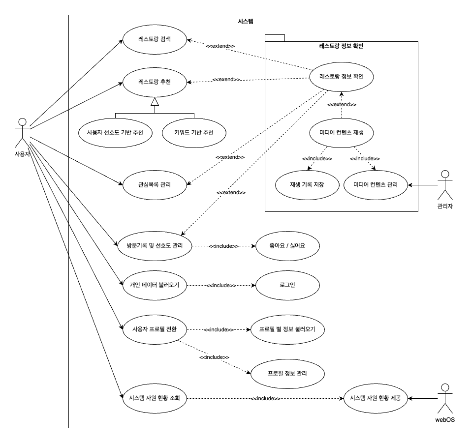

# Michelin in TV
## 목차
- [1. Introduction](#1-introduction)
    - [1.1. 문서 목적 (Purpose)](#11-문서-목적-document-purpose)
    - [1.2. 시스템 범위 (Scope)](#12-시스템-범위-system-scope)
        - [1.2.1. 개발 개요 (Development Overview)](#121-개발-개요-development-overview)
        - [1.2.2. 주요 기능 (Main Features)](#122-주요-기능-main-features)
    - [1.3. 개발 환경 (Development Environment)](#14-개발-환경-development-environment)
- [2. Architectural Drivers](#2-architectural-drivers)
    - [2.1. 유스케이스 다이어그램 (Use Case Diagram)](#21-유스케이스-다이어그램-use-case-diagram)
    - [2.2. 기능 요구사항 (Functional Requirements)](#22-기능-요구사항-functional-requirements)
    <!-- - [2.3. 비기능 요구사항 (Non-Functional Requirements)](#23-비기능-요구사항-non-functional-requirements) -->
- [3. Architectural Overview](#3-arthitectural-overview)
    - [3.1. Frontend Architecture](#31-frontend-architecture)
    - [3.2. Backend Architecture](#32-backend-architecture)
- [4. Data Design](#4-data-design)
    - [4.1. Database Schema](#41-database-schema)

## 1. Introduction
### 1.1. 문서 목적 (Document Purpose)
본 문서는 LG전자의 무선 TV 제품인 「LG 스탠바이미」에서 작동하는 Media Web Application 개발 과제인 「Michelin in TV」의 소프트웨어 아키텍처 문서이다. 본 문서는 「Michelin in TV」의 개발 목적, 범위, 개발 환경 등을 기술하며, 시스템의 기능 및 비기능 요구사항, 시스템의 구조 및 데이터베이스 스키마 등을 명확히 하여 문서화 하는 것을 목적으로 한다.

### 1.2. 시스템 범위 (System Scope)
#### 1.2.1. 개발 개요 (Development Overview)
본 과제에서는 LG전자의 무선 TV 제품인 「LG 스탠바이미」에서 작동하는 Media Web Application 개발 과제로서 「Michelin in TV」의 개발을 수행한다. 최근 넷플릭스에서 방영한 요리 경연 프로그램인 「흑백요리사」의 인기로 미쉐린 가이드에서 선정한 레스토랑에 대한 관심이 높아지고 있다. 이러한 트렌드를 반영하여, 「Michelin in TV」는 사용자들이 손쉽게 미쉐린 가이드에 등재된 레스토랑의 정보를 탐색할 수 있도록 개발한다.

#### 1.2.2. 주요 기능 (Main Features)
본 시스템에서 제공하는 주요 기능은 다음과 같다:

1. *미쉐린 가이드 레스토랑 정보 제공*  
2. *키워드 기반 레스토랑 추천*  
3. *키워드 중심 레스토랑 검색*  
4. *레스토랑 관련 영상 컨텐츠 제공*  
5. *찜목록 및 방문 기록 관리 기능*  
6. *사용자 데이터 기반 맞춤형 추천*  
7. *사용자 프로필 및 다중 사용자 지원*  
8. *로그인을 통한 데이터 동기화*  

상세한 기능 요구사항은 [2. Architectural Drivers](#2-architectural-drivers)에서 확인할 수 있다.

### 1.3. 개발 환경 (Development Environment)
**OS** : Linux, MacOS 
**IDE** : Visual Studio Code 
**Framework** : EnactJS, Express.js, mongoose, mongoDB 
**Language** : JavaScript 
**Version Control** : Git, GitHub 
**Platform** : LG StandbyMe

## 2. Architectural Drivers
이 절에서는 개발 과제의 유스케이스 다이어그램, 기능 요구사항, 비기능 요구사항을 기술한다.
### 2.1. 유스케이스 다이어그램 (Use Case Diagram)

### 2.2. 기능 요구사항 (Functional Requirements)

| ID   | Function                   | Description                                                                                                                                                                                                                                                                                                          | Priority   |
|------|-----------------------------|----------------------------------------------------------------------------------------------------------------------------------------------------------------------------------------------------------------------------------------------------------------------------------------------------------------------|------------|
| FR01 | 레스토랑 검색              | <ol><li>사용자가 검색 버튼을 누르면 검색 인터페이스(UI)를 제공한다.</li> <li>사용자가 검색어를 입력하여 제출하면, 해당 입력값을 서버에 전송한다. 이 때 검색 유효성을 검사하여 공백 문자만으로 이루어진 입력값의 경우 검색을 차단한다.</li> <li>서버는 입력된 검색어를 기반으로 데이터베이스에서 관련 레코드(Record)를 조회하여 반환한다. 관련 레코드는 다음 조건을 충족하는 항목으로 정의된다.</li> <ul><li>검색어가 레코드의 특정 필드(Field) 값에 부분 일치하는 경우 해당 레코드가 선택된다.</li></ul> <li>검색 결과가 없을 경우, 사용자에게 ‘결과가 없습니다’ 메시지를 표시한다.</li> <li>어플리케이션은 반환된 레코드 목록을 사용자에게 표시한다. 이 때, 각 레코드는 사진, 이름, 위치 등의 주요 정보를 포함하는 카드 형태로 나열된다.</li></ol>   | Optional   |
| FR02 | 키워드 기반 레스토랑 추천 | <ol><li>사용자가 어플리케이션에 접속하면, 컨텐츠 제공자가 사전에 키워드별로 분류해 놓은 레스토랑 목록이 키워드에 따라 행 단위로 추천 피드에 표시된다.</li> <li>서버는 컨텐츠 제공자가 구성한 키워드 목록 중 사용자에게 표시할 일부 키워드를 무작위로 선택하여, 해당 키워드에 속하는 모든 레스토랑 데이터를 반환한다.</li> <ul><li>이 때, 컨텐츠 제공자는 항상 표시되어야 할 특정 키워드를 지정할 수 있다.</li></ul> <li>어플리케이션은 넷플릭스와 유사한 피드 UI 형식으로 추천 레코드 목록을 사용자에게 표시하며, 각 레코드를 가로 스크롤 가능한 카드 형태로 사진, 이름, 위치 등의 주요 정보를 포함하여 표시된다.</li></ol>   | Mandatory  |
| FR03 | 사용자 선호도 기반 레스토랑 추천 | <ol><li>사용자가 어플리케이션에 접속하면 방문기록, 관심목록, 좋아요/싫어오 선호도를 바탕으로 한 맞춤 레스토랑의 목록이 추천 피드 최상단에 표시된다.</li> <li>서버는 사용자의 활동 데이터를 분석하여 선호도에 맞춘 레스토랑 목록을 반환한다.</li> <li>어플리케이션은 넷플릭스와 유사한 피드 UI 형식으로 추천 레코드 목록을 사용자에게 표시하며, 각 레코드를 가로 스크롤 가능한 카드 형태로 사진, 이름, 위치 등의 주요 정보를 포함하여 표시된다.</li></ol>   | Optional   |
| FR04 | 레스토랑 정보 조회 | <ol><li>사용자가 특정 레스토랑을 선택하면 해당 레스토랑의 상세 정보 페이지가 제공된다.</li> <li>어플리케이션은 선택된 레스토랑의 세부 정보를 표시하며, 표시 요소는 다음과 같다.</li> <ul><li>이름, 위치, 가격대, 카테고리, 전화번호 등 기본 정보</li> <li>영상, 사진 등 미디어 컨텐츠</li> <li>미디어 컨텐츠 목록</li> <li>(Optional) 연관된 레스토랑 목록</li></ul></ol>   | Mandatory  |
| FR05 | 미디어컨텐츠 재생 | <ol><li>사용자가 레스토랑의 상세 정보 페이지에서 미디어 콘텐츠를 선택하면 페이지 내 제공된 인터페이스에서 미디어 콘텐츠가 표시된다.</li> <li>영상 컨텐츠의 경우 어플리케이션 내에서 재생되며, 일시정지, 재개, 중지 기능을 포함한다.</li> <li>사용자에게 재생 기록을 저장할 수 있는 기능을 제공하여, 다음에 동일한 콘텐츠에 쉽게 접근할 수 있도록 한다.</li></ol>   | Mandatory  |
| FR06 | 관심 목록 관리 | <ol><li>사용자는 특정 레스토랑을 관심 목록에 추가하거나 삭제할 수 있다.</li> <li>관심목록은 사용자 별로 저장되며, 사용자가 어플리케이션에 접속하면 접근할 수 있다.</li> <li>어플리케이션은 관심 목록을 그리드 UI 형식으로 사용자에게 표시하며, 각 레스토랑은 대표 이미지와 함께 이름, 위치 등의 주요 정보를 카드 형태로 나열한다.</li></ol>   | Optional   |
| FR07 | 방문 기록 및 선호도 관리 | <ol><li>사용자는 방문한 레스토랑을 추가할 수 있으며, 방문 기록을 조회하고 관리할 수 있다.</li> <li>방문 기록에는 방문 횟수, 방문 날짜, 선호도(좋아요/싫어요) 등이 포함된다.</li> <li>방문 기록은 그리드 UI형식으로 제공되며 각 레스토랑의 대표 이미지와 함께 주요 정보가 카드 형태로 표시된다.</li> <li>방문 기록과 선호도 정보는 추천 시스템과 연동되어 사용자 맞춤형 추천에 활용된다.</li></ol>   | Optional   |
| FR08 | 개인 데이터 불러오기 | <ol><li>사용자가 로그인하면 서버는 사용자 계정에 연동된 개인 데이터(ex. 관시 목록, 방문 기록, 선호도 정보)를 불러온다.</li> <li>불러온 개인 데이터는 사용자의 앱 인터페이스 내에서 표시되며, 이전에 저장된 정보들을 사용할 수 있도록 한다.</li> <li>개인 데이터는 서버와 동기화되어 다른 기기에서 로그인하더라도 동일한 데이터를 불러올 수 있도록 한다.</li></ol>   | Optional   |
| FR09 | 사용자 프로필 전환 | <ol><li>사용자가 프로필 전환 기능을 통해 동일한 기기에서 여러 사용자 프로필 간의 빠른 전환이 가능하다.</li> <li>프로필 전환 시 각 사용자에 대한 관심 목록, 방문 기록, 선호도 설정 등 개인화된 데이터를 불러온다.</li> <li>어플리케이션은 각 프로필에 맞춘 UI와 추천 목록을 제공한다.</li></ol>   | Mandatory  |
| FR10 | 실시간 시스템 자원현황 시각화 | <ol><li>애플리케이션 내에서 현재 시스템 자원의 상태를 실시간으로 시각화하여 제공한다.</li> <li>시각화되는 자원 정보는 CPU 사용량, 메모리 사용량 등을 포함하며, 시스템 성능을 모니터링할 수 있다.</li> <li>시스템 자원 현황은 그래프 또는 차트 형태로 제공되며, 임베디드 환경 상에서의 시스템 활용 정보를 제공한다.</li></ol>   | Mandatory  |

<!-- ### 2.3. 비기능 요구사항 (Non-Functional Requirements) -->

## 3. Arthitecture Overview
### 3.1. 시스템 컨텍스트 (System Context)
본 절에서는 App의 system context에 대해 기술한다.

### 3.2. Static View

## 4. Data Design
### 4.1. Database Schema/Data model
