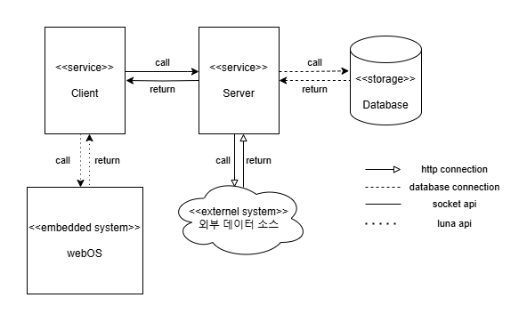
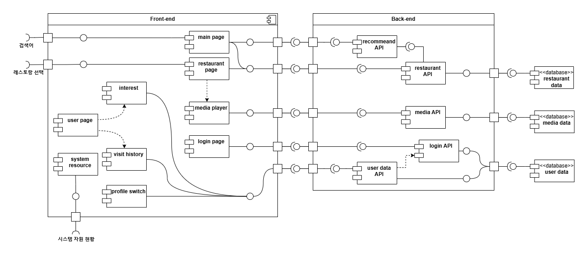
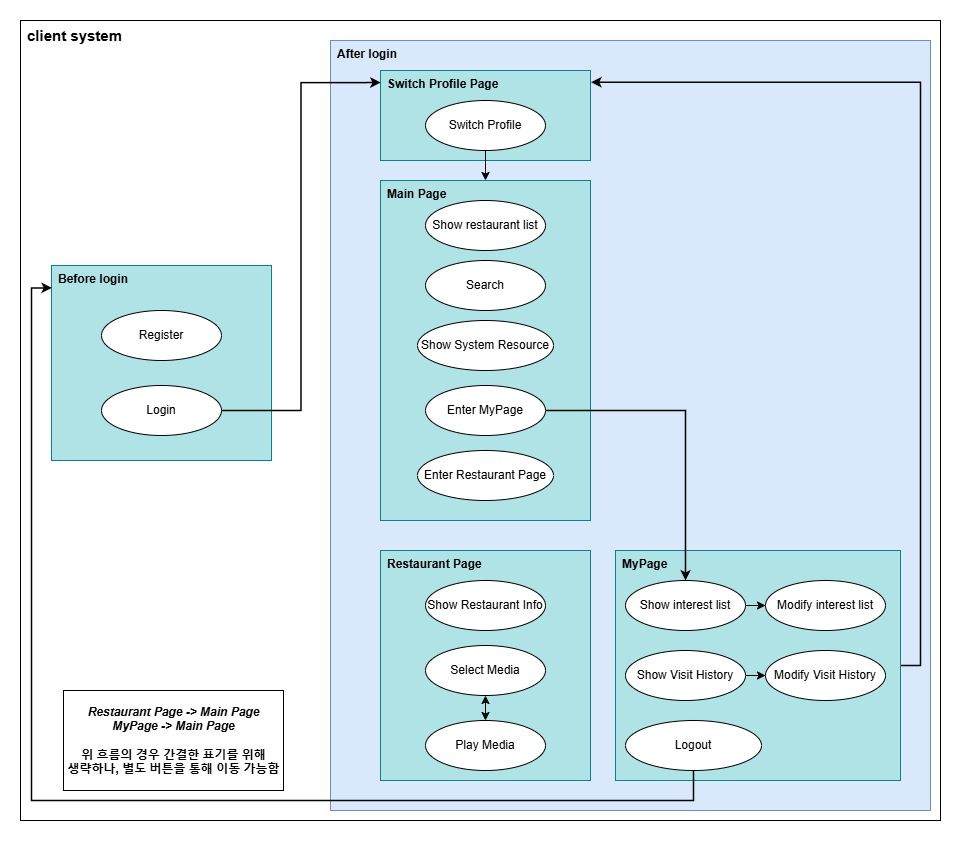

## 목차

- [목차](#목차)
- [1. System Context](#1-system-context)
- [2. Static Perspective](#2-static-perspective)

---

## 1. System Context

### 주요 구성 요소

**User**
- 애플리케이션을 사용하는 최종 사용자.
- 레스토랑 검색, 추천, 정보 조회와 같은 기능을 사용할 수 있다.

**Frontend**
- 사용자의 요청을 처리하고 인터페이스를 통해 데이터를 표시하는 시스템.
- 사용자의 요청에 따라 Backend 서버와 상호작용하여 필요한 데이터를 요청하거나 전송한다.

**Backend**
- Frontend에서 요청한 데이터를 처리하고, 데이터베이스와의 상호작용을 통해 필요한 정보를 제공한다.
- 주요 역할:
  - 레스토랑 데이터 처리
  - 사용자 선호도 및 방문 기록 관리
  - 추천 데이터 생성 및 제공

---

## 2. Static Perspective

### 주요 모듈

#### **Frontend**
- **기능**:
  - 사용자의 요청에 따라 Backend와 통신하고 결과를 화면에 표시.
  - 메인 페이지, 레스토랑 상세 페이지, 관심 목록, 방문 기록, 사용자 페이지, 프로필 전환, 시스템 자원 현황 등 다양한 UI를 제공.
- **하위 컴포넌트**:
  - `main page`: 검색 및 추천 레스토랑 목록을 표시.
  - `restaurant page`: 특정 레스토랑의 상세 정보를 제공.
  - `interest`: 관심 목록 레스토랑 조회 및 관리.
  - `visit history`: 사용자의 방문 기록 조회 및 관리.
  - `profile switch`: 사용자 프로필을 전환할 수 있는 기능 제공.
  - `media player`: 레스토랑 관련 미디어 콘텐츠 재생.
  - `system resource`: 시스템 자원 상태를 시각화.

#### **restaurant API**
- **기능**:
  - 특정 키워드나 조건에 따라 레스토랑 데이터를 검색 및 조회.
  - 데이터베이스와 상호작용하여 레스토랑 목록, 상세 정보 등을 제공.

- **인터페이스**:
  - `search`: 특정 키워드나 조건에 따라 레스토랑 데이터를 검색 및 반환.
  - `get_info`: 특정 레스토랑의 상세 정보를 반환.

#### **recommendation API**
- **기능**:
  - 사용자 선호도 기반 맞춤형 레스토랑 추천 데이터 생성.
  - 키워드 기반 레스토랑 추천 데이터 생성.
- **인터페이스**:
  - `get_recommendation`: 사용자 선호도 기반 맞춤형 레스토랑 추천 데이터를 반환.
  - `get_keyword_recommendation`: 키워드 기반 레스토랑 추천 데이터를 반환.

#### **media API**
- **기능**:
  - 레스토랑 관련 미디어 콘텐츠(사진, 동영상 등)의 스트리밍 제공.
  - 미디어 콘텐츠 재생 기록 저장.
- **인터페이스**:
  - `stream`: 미디어 콘텐츠 스트리밍 제공.
  - `save_playback_history`: 미디어 콘텐츠 재생 기록 저장.
  - `get_playback_history`: 미디어 콘텐츠 재생 기록 조회.

#### **user data API**
- **기능**:
  - 사용자 정보 및 데이터를 관리.
  - 관심 목록, 방문 기록 등 사용자와 관련된 데이터를 반환.
- **인터페이스**:
  - `get_profile_list` : 사용자 프로필 목록을 반환.
  - `get_user_info`: 사용자 정보를 반환.
  - `get_interest_list`: 사용자의 관심 목록을 반환.
  - `get_visit_history`: 사용자의 방문 기록을 반환.

#### **login API**
- **기능**:
  - 사용자 로그인 및 인증.
  - 사용자 세션을 관리하여 데이터 접근 제어.
- **인터페이스**:
  - `login`: 사용자 로그인 및 인증.

#### **database**
- **기능**:
  - MongoDB를 사용하여 레스토랑 정보, 사용자 정보, 방문 기록, 선호도 데이터 등을 저장.

### 3. Dynamic Perspective

#### 3.1. State Diagram

 

- 로그인 이전 상태에서 `Login`을 통해 로그인 이후 상태로 변경할 수 있다. 이 때, 서버에서 `Login`에서 입력받은 ID값이 등록되어 있어야 로그인 상태로 변경될 수 있다. 등록되지 않은 id인 경우 로그인에 실패한다.
- 로그인 이후 `Switch Profile Page`로 이동하며, 프로필을 선택하여 Main Page`로 이동할 수 있다.
- `Main Page`에서는 추천된 레스토랑의 목록을 확인할 수 있으며, `Search`,`System System Resource` 등의 기능을 제공한다. 또한, `Restaurant Page` 및 `MyPage`로 이동할 수 있다.
- `Restaurant Page`에서는 특정 레스토랑의 상세 정보를 확인할 수 있으며, `Select Media`를 통해 미디어 콘텐츠를 선택하고 재생할 수 있다.
- `MyPage`에서는 사용자의 관심 목록 및 방문 기록을 확인할 수 있으며, `Profile Switch`를 통해 사용자 프로필을 전환할 수 있다. 또한, `Logout`을 통해 로그아웃 상태로 변경할 수 있다.

#### 3.2. Sequence Diagram

#### 3.3. Module

본 문서에서 모듈은 사용자에게 제공되는 기능을 수행하는 단위를 의미한다. 해당 문서에서는 총 19개의 모듈을 포함한다. 이는 [3.1 State Diagram](#31-state-diagram) 의 function과 일대일 대응된다.

##### Before Login

1. Register
- 사용자 정보를 입력받아 서버로부터 ID를 발급받는 기능
- 사용자 정보의 포맷을 검증하고, 서버로 요청한다.

2. Login
- ID를 입력받아 서버에 등록되어 있는 ID인 경우 로그인 이후 상태로 변경하는 기능
- 사용자 정보의 포맷을 검증하고, 서버로 요청한다.

###### After Login

1. Switch Profile
- 사용자 프로필을 전환할 수 있는 기능 제공
- 로컬에 저장된 사용자 프로필 목록을 조회하고, 선택한 프로필로 전환한다.

2. Show Restaurant List
- 레스토랑 목록을 조회하는 기능
- 서버로부터 레스토랑 추천 목록을 요청하고, 사용자에게 출력한다.

3. Search
- 특정 키워드나 조건에 따라 레스토랑 데이터를 검색하는 기능
- 사용자로부터 검색 키워드를 입력받고, 서버로 검색 요청을 전송한다.
- 서버로부터 수신한 정보는 실시간으로 사용자에게 출력한다.

4. Show System Resource
- 시스템 자원 상태를 시각화하는 기능
- WebOS로부터 시스템 자원 상태를 수신하고, 사용자에게 출력한다.

5. Enter MyPage
- 사용자의 관심 목록 및 방문 기록을 조회하는 기능
- 서버로부터 사용자의 관심 목록 및 방문 기록을 요청하여 로컬에 저장한다.

6. Enter Restaurant Page
- 특정 레스토랑의 상세 정보를 조회하는 기능
- 사용자가 선택한 레스토랑의 상세 정보와 미디어 콘텐츠 목록을 서버로부터 요청하여 local에 저장한다.

7. Show Restaurant Info
- 특정 레스토랑의 상세 정보를 출력하는 기능
- 로컬에 저장된 특정 레스토랑의 상세 정보를 사용자에게 출력한다.

8. Select Media
- 레스토랑 관련 미디어 콘텐츠를 선택하고 재생하는 기능
- 사용자가 선택한 미디어 콘텐츠의 index파일을 서버로부터 요청하여 local에 저장한다.

9. Show Interest List
- 사용자의 관심 목록을 조회하는 기능
- 로컬에 저장된 사용자의 관심 목록을 사용자에게 출력한다.

10. Modify Interest List
- 사용자의 관심 목록을 수정하는 기능
- 사용자로부터 추가/삭제할 레스토랑의 index를 입력받아 서버로 전송한다.
- 변경된 관심 목록은 서버로부터 다시 요청하여 로컬에 저장하며, 사용자에게 출력한다.

11. Show Visit History
- 사용자의 방문 기록을 조회하는 기능
- 로컬에 저장된 사용자의 방문 기록을 사용자에게 출력한다.

12. Modify Visit History
- 사용자의 방문 기록을 수정하는 기능
- 사용자로부터 추가/삭제할 레스토랑의 index를 입력받아 서버로 전송한다.
- 변경된 방문 기록은 서버로부터 다시 요청하여 로컬에 저장하며, 사용자에게 출력한다.

13. Logout
- 로그인 이후 상태에서 로그인 이전 상태로 변경하는 기능