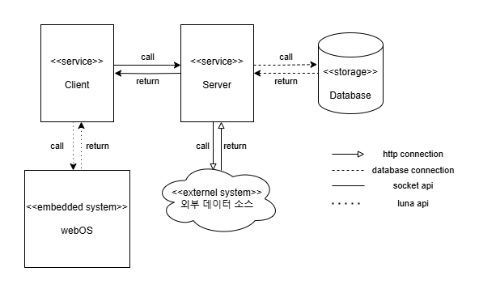

# Michelin in TV 요구사항 명세서

## 목차
[1. 문서 설명(Document Description)](#1-문서-설명document-description)
  [1.1. 목적(Purpose)](#11-목적purpose)
  [1.2. 범위(Scope)](#12-범위scope)
  [1.3. 용어 및 정의(Terminologies and Definitions)](#13-용어-및-정의terminologies-and-definitions)
[2. 시스템 컨텍스트(System Context)](#2-시스템-컨텍스트system-context)
[3. 요구사항(Requirements)](#3-요구사항requirements)
  [3.1. 기능 요구사항(Functional Requirements)](#31-기능-요구사항functional-requirements)
    [3.1.1. ](#)
    
  [3.2. 품질 요구사항(Quality Attributes)](#32-품질-요구사항quality-attributes)
  [3.3. 제약 사항(Constraint Requirements)](#33-제약-사항constraint-requirements)

## 1. 문서 설명(Document Description)

### 1.1. 목적(Purpose)
본 문서는 LG전자의 무선 TV 제품인 「LG 스탠바이미」에서 작동하는 Media Web Application인 「Michelin in TV」의 소프트웨어 아키텍처 문서다. 문서의 목적은 「Michelin in TV」의 개발 목적, 범위, 개발 환경 등을 기술하며, 시스템의 기능 및 비기능 요구사항, 구조 및 데이터베이스 스키마를 명확히 문서화하는 것이다.

### 1.2. 범위(Scope)
본 문서의 범위는 제약사항(Constraints), 기능 요구사항(Functional Requirements), 품질 요구사항(Quality Attributes)을 포함하며, 이를 설명하기 위한 시스템 컨텍스트(System Context)와 용어 정의를 포함한다.

### 1.3. 용어 및 정의(Terminologies and Definitions)
- **OS** : Linux, MacOS
- **IDE** : Visual Studio Code
- **Framework** : EnactJS, Express.js, mongoose, mongoDB
- **Language** : JavaScript
- **Version Control** : Git, GitHub
- **Platform** : LG StandbyMe

## 2. 시스템 컨텍스트(System Context)
Michelin in TV 시스템은 사용자가 미쉐린 가이드에 등재된 레스토랑 정보를 탐색하고 맞춤형 추천을 받을 수 있도록 지원한다. 시스템은 frontend 서버와 backend 서버로 구성되며, frontend는 사용자가 접근하는 화면을 제공하고, backend는 데이터를 관리하고 frontend와 상호작용한다.

## 3. 요구사항

### 3.1. 기능 요구사항 (Functional Requirements)

#### Backend Server

##### 3.1.1. Client로부터 입력받을 interface 제공
ID | Requirement | API ID | Test Case ID
--- | --- | --- | ---

##### 3.1.2. 데이터베이스의 데이터 요청 처리
ID | Requirement | API ID | Test Case ID
--- | --- | --- | ---

---

#### Frontend Server

##### 3.1.3. 
ID | Requirement | Test Case ID
--- | --- | --- | ---

##### 3.1.4.
ID | Requirement | Test Case ID
--- | --- | --- | ---

---

### 3.2. 품질 요구사항 (Quality Attribute)
ID | Requirement
--- | ---

### 3.3. 제약 사항 (Constraint Requirement)
ID | Requirement
--- | ---
CR01 | MongoDB 데이터베이스 사용
CR02 | 서버와 프레임워크는 Node.js, Express로 사용
