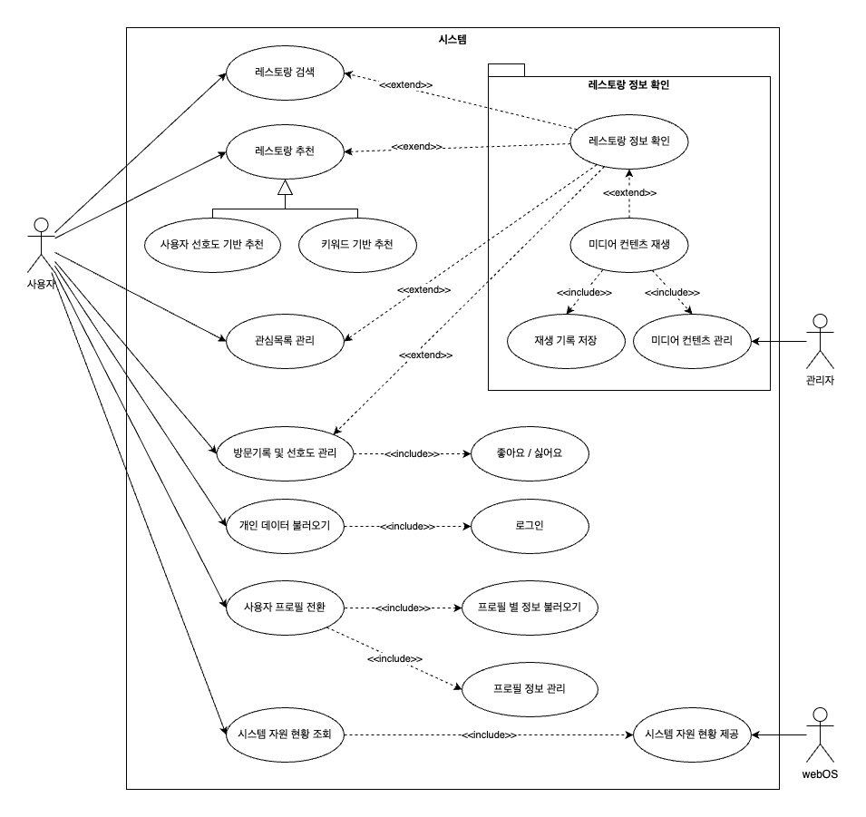

# Michelin in TV

## Use Case 다이어그램

## 1. 레스토랑 검색

ID  | Description  
--- | ---  
유스케이스명 | 레스토랑 검색  
액터명 | 사용자  
개요 | 사용자가 검색어를 통해 레스토랑을 찾기 위해 검색 기능을 이용한다.  
사전조건 | <li> 시스템이 사용자에게 검색 인터페이스를 제공할 수 있어야 한다.</li><li> 네트워크 연결이 정상적이어야 한다.</li>  
사후조건 | <li> 사용자는 검색어에 부합하는 레스토랑 목록을 제공 받는다.</li>  
기본흐름 | <li> 사용자가 검색 인터페이스에 검색어를 입력한다.</li><li> 서버가 데이터베이스에서 일치하는 레코드를 조회하여 반환한다.</li><li> 검색 결과가 없으면 시스템이 '결과가 없습니다' 메시지를 표시한다.</li><li> 검색 결과가 있으면 각 레스토랑이 카드 형태로 사용자에게 표시된다.</li>  
대체흐름 | 1. 시스템은 검색어의 유효성을 검사한다.   1.a 시스템은 유스케이스를 종료한다.

---

## 2. 키워드 기반 레스토랑 추천

ID  | Description  
--- | ---  
유스케이스명 | 키워드 기반 레스토랑 추천  
액터명 | 사용자  
개요 | 사용자가 키워드별로 추천된 레스토랑 목록을 제공받기 위해 키워드 추천 기능을 이용한다.  
사전조건 | <li> 사용자가 애플리케이션에 접속한 상태여야 한다.</li><li> 서버에 키워드별로 분류된 레스토랑 목록이 존재해야 한다.</li>  
사후조건 | <li> 사용자는 키워드에 따라 추천된 레스토랑 목록을 제공받는다.</li>  
기본흐름 | <li> 사용자가 애플리케이션에 접속한다.</li><li> 서버가 무작위로 선택한 키워드와 관련된 레스토랑 데이터를 가져온다.</li><li> 시스템은 각 레스토랑을 사진, 이름, 위치 등의 정보로 구성된 카드 형태로 표시한다.</li>  
대체흐름 |   

---

## 3. 사용자 선호도 기반 레스토랑 추천

ID  | Description  
--- | ---  
유스케이스명 | 사용자 선호도 기반 레스토랑 추천  
액터명 | 사용자  
개요 | 사용자가 방문 기록과 선호도에 맞춘 맞춤형 레스토랑 목록을 제공받기 위해 선호도 추천 기능을 이용한다.  
사전조건 | <li> 사용자가 로그인 상태여야 한다.</li><li> 시스템이 사용자의 선호도를 분석할 수 있는 상태여야 한다.</li>  
사후조건 | <li> 사용자는 개인 맞춤형 레스토랑 목록을 제공받는다.</li>  
기본흐름 | <li> 사용자가 애플리케이션에 접속한다.</li><li> 사용자가 로그인한다.</li><li> 서버가 사용자의 방문 기록과 선호도를 분석하여 맞춤형 레스토랑 목록을 제공한다.</li><li> 시스템은 스크롤 가능한 카드 형식으로 추천 목록을 표시한다.</li>  
대체흐름 | 

---

## 4. 레스토랑 정보 조회

ID  | Description  
--- | ---  
유스케이스명 | 레스토랑 정보 조회  
액터명 | 사용자  
개요 | 사용자가 특정 레스토랑의 상세 정보를 보기 위해 정보 조회 기능을 이용한다.  
사전조건 | <li> 사용자가 메인페이지에서 특정 레스토랑을 선택할 수 있어야 한다.</li>  
사후조건 | <li> 사용자가 선택한 레스토랑의 상세 정보를 제공받는다.</li>  
기본흐름 | <li> 사용자가 특정 레스토랑을 선택한다.</li><li> 시스템이 해당 레스토랑의 상세 정보를 불러와 제공한다.</li><li> 정보에는 이름, 위치, 가격대, 카테고리, 전화번호, 사진, 영상 등이 포함된다.</li>  
대체흐름 |   

---

## 5. 미디어 콘텐츠 재생

ID  | Description  
--- | ---  
유스케이스명 | 미디어 콘텐츠 재생  
액터명 | 사용자  
개요 | 사용자가 레스토랑 정보 페이지에서 제공된 미디어 콘텐츠를 재생하기 위해 미디어 재생 기능을 이용한다.  
사전조건 | <li> 사용자가 미디어 콘텐츠를 선택할 수 있는 상태여야 한다.</li>  
사후조건 | <li> 미디어 콘텐츠가 재생되고, 재생 기록이 저장된다.</li>  
기본흐름 | <li> 사용자가 레스토랑의 미디어 콘텐츠를 선택한다.</li><li> 시스템이 콘텐츠를 재생하며, 일시정지, 재개, 중지 기능을 제공한다.</li><li> 재생 기록이 저장되어 이후 접근이 용이하다.</li>  
대체흐름 |   

---

## 6. 관심 목록 관리

ID  | Description  
--- | ---  
유스케이스명 | 관심 목록 관리  
액터명 | 사용자  
개요 | 사용자가 관심 있는 레스토랑을 관심 목록에 추가하거나 삭제하고 조회할 수 있다.  
사전조건 | <li> 사용자가 애플리케이션에 접속한 상태여야 한다.</li><li> 사용자가 로그인한 상태여야 한다.</li>
사후조건 | <li> 관심 목록이 업데이트되어 표시된다.</li>  
기본흐름 | <li> 사용자가 특정 레스토랑을 선택하여 관심 목록에 추가 또는 삭제한다.</li><li> 시스템이 관심 목록을 업데이트한다.</li><li> 사용자는 업데이트된 목록을 조회할 수 있다.</li>  
대체흐름 |   

---

## 7. 방문 기록 및 선호도 관리

ID  | Description  
--- | ---  
유스케이스명 | 방문 기록 및 선호도 관리  
액터명 | 사용자  
개요 | 사용자가 방문한 레스토랑 기록과 선호도를 관리할 수 있다.  
사전조건 | <li> 사용자가 방문 기록과 선호도를 조회하거나 수정할 수 있는 상태여야 한다.</li>  
사후조건 | <li> 방문 기록과 선호도가 업데이트되어 추천 시스템에 반영된다.</li>  
기본흐름 | <li> 사용자가 방문한 레스토랑을 추가 또는 조회한다.</li><li> 시스템이 방문 날짜, 횟수, 선호도 등의 정보를 표시한다.</li><li> 시스템이 정보를 업데이트하여 추천 시스템에 반영한다.</li>  
대체흐름 |   

---

## 8. 개인 데이터 불러오기

ID  | Description  
--- | ---  
유스케이스명 | 개인 데이터 불러오기  
액터명 | 사용자  
개요 | 사용자가 로그인하여 이전에 저장된 개인 데이터를 불러올 수 있다.  
사전조건 | <li> 사용자가 로그인한 상태여야 한다.</li>  
사후조건 | <li> 사용자의 관심 목록, 방문 기록, 선호도 등이 인터페이스에 표시된다.</li>  
기본흐름 | <li> 사용자가 로그인한다.</li><li> 서버가 개인 데이터를 불러온다.</li><li> 애플리케이션 인터페이스가 개인 데이터로 업데이트된다.</li>  
대체흐름 |   

---

## 9. 사용자 프로필 전환

ID  | Description  
--- | ---  
유스케이스명 | 사용자 프로필 전환  
액터명 | 사용자  
개요 | 동일 기기에서 여러 사용자 프로필을 전환하여 각 프로필에 맞춘 데이터를 불러올 수 있다.  
사전조건 | <li> 동일 기기 내에 여러 프로필이 존재해야 한다.</li>  
사후조건 | <li> 선택한 프로필에 따라 사용자 정보와 추천 컨테츠가 업데이트된다.</li>  
기본흐름 | <li> 사용자가 프로필 전환한다.</li><li> 시스템이 선택한 프로필에 맞는 데이터를 불러온다.</li><li> 맞춤형 추천 목록과 설정이 표시된다.</li>  
대체흐름 | 1. 사용자가 유효하지 않은 전환을 시도한다.   1.a 시스템은 유스케이스를 종료한다.

---

## 10. 실시간 시스템 자원 현황 시각화

ID  | Description  
--- | ---  
유스케이스명 | 실시간 시스템 자원 현황 시각화  
액터명 | 사용자  
개요 | 사용자가 시스템 자원 현황을 실시간으로 확인하기 위해 시각화 기능을 이용한다.  
사전조건 | <li> 애플리케이션이 시스템 자원 상태를 가져올 수 있어야 한다.</li>  
사후조건 | <li> 시스템 자원의 실시간 상태가 사용자에게 표시된다.</li>  
기본흐름 | <li> 사용자가 시스템 자원 현황 시각화 도구를 연다.</li><li> 시스템이 CPU, 메모리 사용량 등 자원 정보를 가져온다.</li><li>시스템은 자원 사용 현황을 그래프 또는 차트 형태로 실시간 표시한다.</li><li>사용자는 자원 사용 현황을 확인한다.</li>  
대체흐름 |   
---